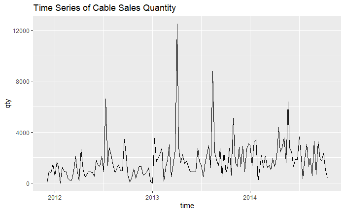
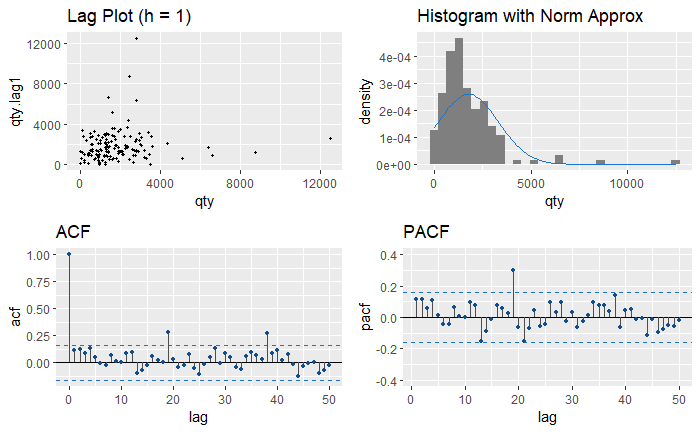
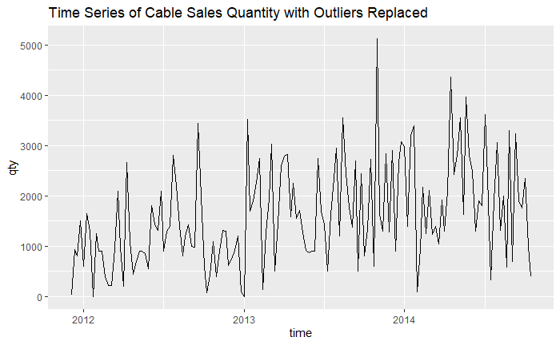
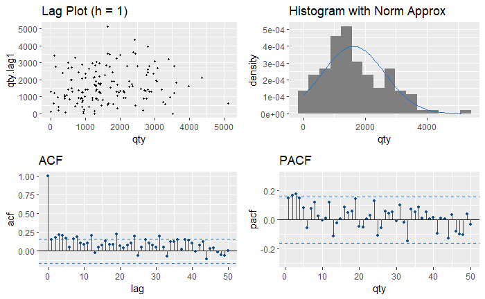
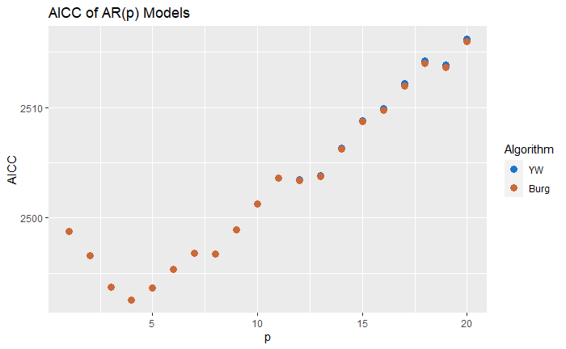
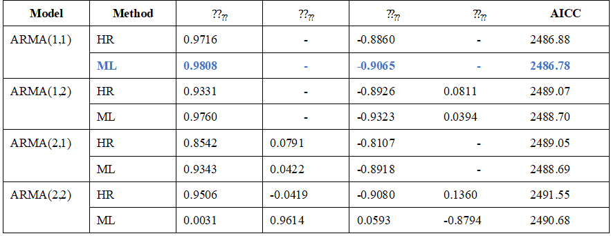
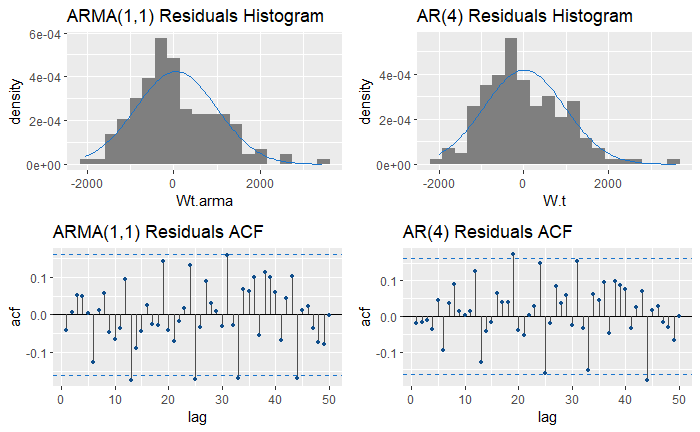
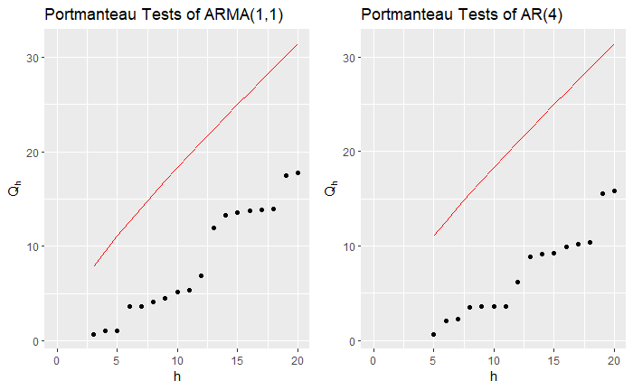
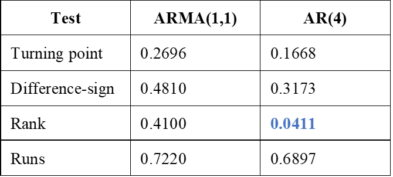
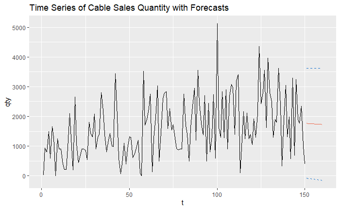

# STAT 519 Term Project: Data Analysis of DKSH Dataset

### I. Introduction
In this paper, I will analyze the DKSH dataset, which contains weekly sales data of industrial cables from Dec. 2011 to Oct. 2014. The DKSH dataset was acquired through an industry-university joint research project initiated by the course Statistical Data Analysis for Business and Management in my junior year at National Taiwan University. DKSH is a market expansion services provider in the Asia-Pacific area that procures materials and supplies for its customers. To further reduce its transportation and storage costs, DKSH hoped to forecast its sales (demand of customers) more accurately based on this dataset. However, since statistical methods covered in the course Statistical Data Analysis for Business and Management included only regression analysis and categorical data analysis, I could not analyze this dataset efficiently at that time. Thus, the purpose of this paper is to revisit the DKSH dataset and forecast the sales based on time series analysis. I will first perform exploratory data analysis, propose several possible time series models, and then conduct diagnostic tests to see if these models are good fits for the data. Finally, the conclusion will be made based on the model that best fits the dataset.

### II. Data Exploration
The following figure shows the DKSH dataset.

 

  

 Fig1: DKSH time series 

 

The most significant feature of this time series is that there are several spikes, or so-called bulk orders in business. These spikes may be crucial in terms of decision making in business, yet they might cause a serious impact on our analysis. I also conducted a Dickey-Fuller test to check whether this time series is stationary, and the result shows a p-value of 0.01. Therefore, we may conclude that this time series is stationary.

To further explore this dataset, I plotted the lag plot of lag = 1, histogram of the dataset, and ACF and PACF. 

 

  

 Fig2: Preliminary data exploration 

 

Both the lag plot and the histogram show that there are a few significant outliers, consistent with what we discovered in Fig1. The ACF and PACF plots also indicate that the outliers may have a significant impact on the correlations. For instance, the significant spike at lag = 19 may be caused by the correlation between t = 70 and t = 89, when there are two sales spikes in Mar. 2013 and Aug. 2013 with values of 12500 and 8780 respectively. Therefore, to better forecast this time series, I will replace these outliers with some other alternatives. However, as I mentioned earlier, please note that these spikes may be crucial in business decision making. For instance, in response to the outbreak of pandemic, retailers may want to prepare for unexpected sales increases to ensure that every customer has the items they need during home quarantine. Here I am replacing these outliers just to better estimate the rest of the sales that are considered as ordinary situations. 

I defined outliers as values that are three standard deviations away from the mean  and discovered the following four outliers: 
t = 32, t = 70, t = 89, and t = 129. I implemented Levinson-Durbin recursions to replace these outliers with one-step-ahead predictions. That is, for instance, for the outlier at t = 32, I replaced it with the prediction based on t = 1 to 31 through Levinson-Durbin recursions.  The following figure shows the time series with outliers being replaced. 

 

  

 Fig3: DKSH time series with outliers replaced 

 

Similarly, I plotted the lag plot of lag = 1, histogram, and ACF and PACF of the new time series.

 

  

 Fig4: Data exploration without outliers 

 

The lag plot shows that there seems to be no significant correlation between X_(t+1) and X_t. The histogram shows that the time series may be approximately Gaussian but there is a significant bump on the right side of the distribution. The PACF plot shows that an AR(2) or AR(3) model may be a suitable choice; however, the ACF plot does not show an exponential decay which AR(p) models should have. Thus, an ARMA(p,q) may also be considered. 

### III. Model Selection
In this section, I will fit this time series with AR(p) and ARMA(p,q) models. I first implemented Yule-Walker estimation and Burg’s algorithm to determine the best AR(p) model. The following figure shows the AICC of different AR(p) models. 

 

  

 Fig5: AICC of different AR(p) models based on Yule-Walker and Burg methods 

 

The result shows that AR(4) is the best model with AICC = 2493. This may contradict our previous assumption that AR(2) or AR(3) may be a good choice. However, if we review the PACF in Fig4, we may see that the PACF at lag 4 is close to the 95% confidence boundary; the cut-off between lag 4 and 5 is more significant than that of between lag 3 and 4. Therefore, AR(4) may also be a reasonable choice. 

I then fitted ARMA(p,q) models to the time series based on Hannan-Rissanen algorithm and maximum likelihood estimation. The results are shown in the following chart.

 

  

 Fig6: Results of ARMA(p,q) models based on Hannan-Rissanen and maximum likelihood methods 

 

The results show that maximum likelihood estimation performs consistently better than Hannan-Rissanen algorithm, while both methods indicate that ARMA(1,1) is the best model with the lowest AICC = 2486.78, indicating that ARMA(1,1) is a better model than AR(4) of which AICC = 2493. Please also note that the result of ARMA(2,2) – ML is quite different from others, giving  and  more weights than  and .  

### IV. Diagnostic Tests
Before declaring that ARMA(1,1) is the best model, we need to conduct diagnostic tests to see whether ARMA(1,1) is a good fit to the data. In comparison, I also conducted diagnostic tests for AR(4) model. 

 

  

 Fig7: Residuals of ARMA(1,1) and AR(4) models 

 

The results show that ARMA(1,1) seems not a good fit to the data: the residuals stray a bit away from Gaussian, and several values exceed the 95% confidence boundaries in the ACF plot. In comparison, the residuals of AR(4) fits better to Gaussian; however, the values at lag = 19 and lag = 44 still exceed the 95% confidence boundaries in the ACF plot. Thus, based on Fig7, both models may not be good fits to the data. To further examine whether both models are valid, I applied them to several hypothesis testings: portmanteau test, turning point test, difference-sign test, rank test, and runs test. 

 

  

 Fig8: Portmanteau tests of ARMA(1,1) and AR(4) residuals 

 

The result of portmanteau tests indicate that residuals of both models are IID noises. The results of the rest of the tests are shown in the following chart. 

 

  

 Fig9: P-values of tests for ARMA(1,1) and AR(4) 

 

All tests indicate that ARMA(1,1) residuals are IID noise, while the rank test indicates that AR(4) residuals may not be IID noise since p-value < 0.05. In conclusion, considering all results from our diagnostic tests, ARMA(1,1) may be a better fit to the data since all hypothesis testings suggest that its residuals are IID noise. However, we still need to beware that the ACF plot indicates that there are some correlations between the residuals.  

### V. Conclusion
In this paper, I have examined the DKSH dataset and concluded that ARMA(1,1) based on maximum likelihood estimation is the best fit to the time series. The results of the diagnostics tests also support the model, though there are some concerns regarding the ACF of residuals. The following plot shows the forecast of the ARMA(1,1). 

 

  

 Fig10: DKSH time series with up to ten-steps-ahead forecasts and 95% confidence bounds 

 

However, please note that in this paper we have omitted the impact of outliers, which should be considered in real business cases. A common approach to tackle this problem is to apply the concept of service level, which is the probability that a business would not run out of stocks given a certain amount of inventory. For instance, a 95% service level indicates that 95% of the time the business would not run out of stocks. Thus, to reach a 95% service level, DKSH should prepare its inventory based on the upper 95% confidence bound. For instance, given that the upper 95% confidence bounds of the first four weeks forecasted are 3612, 3613, 3613, and 3613, DKSH should prepare 14451 stocks for the following month to reach 95% service level. Applying higher percentages of service level could further mitigate the impact of outliers. 

